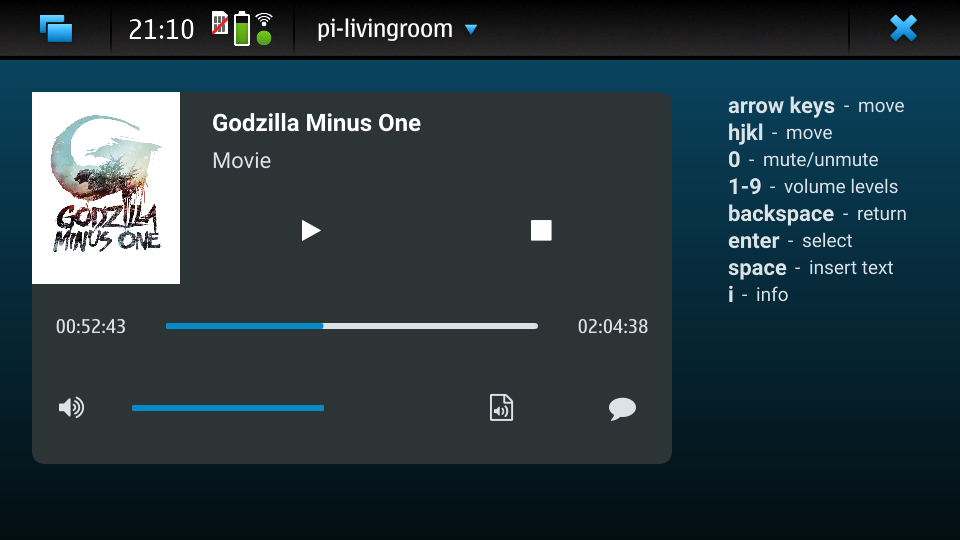
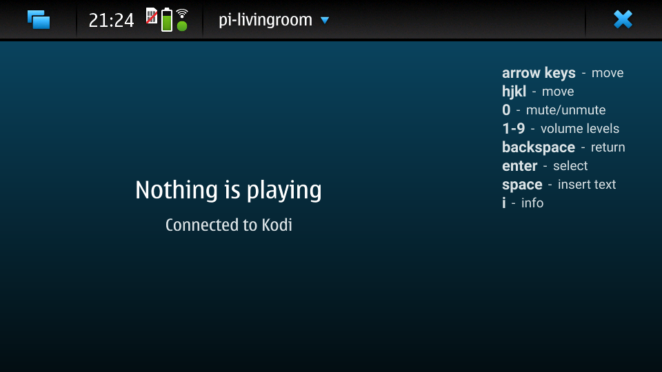
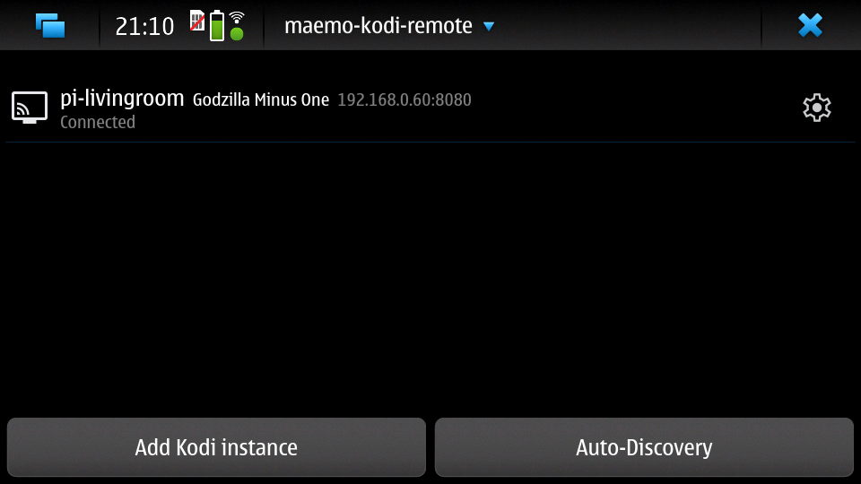
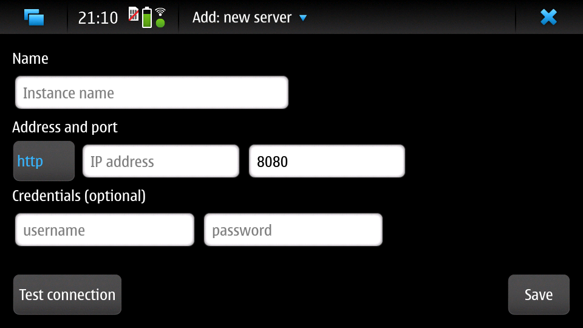

## maemo-kodi-remote

A simple and easy-to-use Kodi remote for devices running Maemo Leste with a physical keyboard.

It also runs well on a regular desktop (although Linux only).

### Features

- Manage multiple Kodi instances
- Auto-discovery on LAN
- Media thumbnail
- Navigation & play/pause/stop
- Volume control
- Mute/unmute
- Sending keystrokes
- Choose audio stream
- Choose subtitle

### Screenshots

### To-do

- on-screen remote (for devices without physical keyboard)
- in-app library browser
- seeking (currently need to press `i` first)
